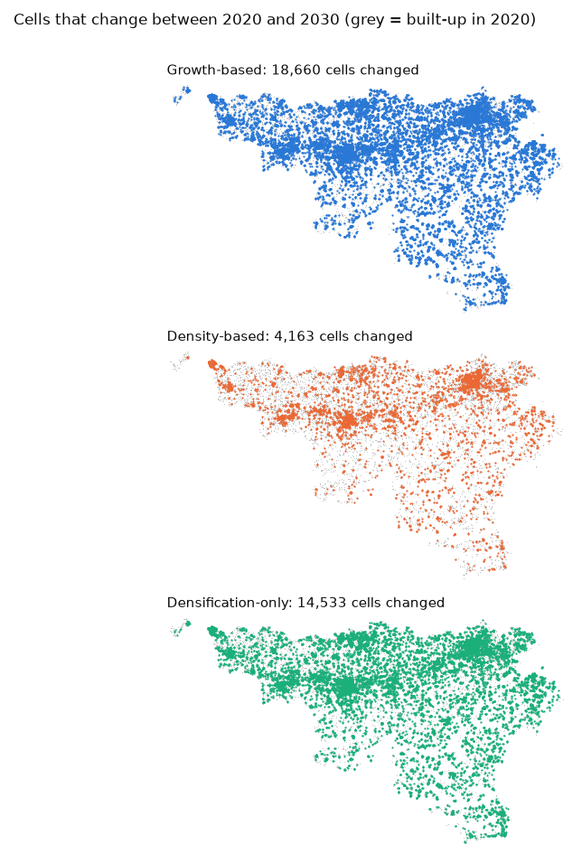
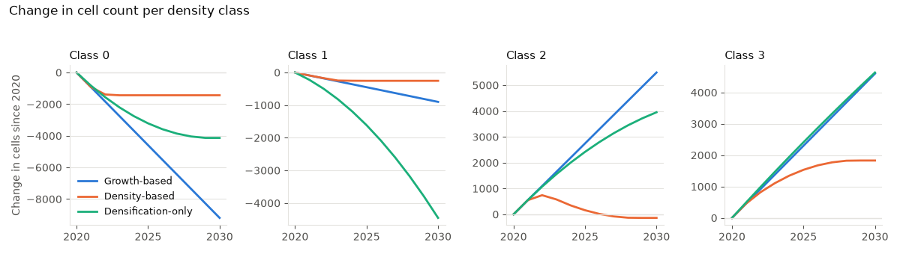

# SuSceMod
SuSceMod is a codebase meant for <ins>Su</ins>stainable <ins>Sce</ins>nario <ins>Mod</ins>elling of urban built-up.
This Python code is a part of the Sustainable Densification project. This code calibrates and models futuristic urban growth at a regional scale.

## Installation
From the root of this repository:
```
pip install -e .
```
This installs `numpy`, `pandas`, `rasterio`, `matplotlib`, `seaborn`, `openpyxl`, `tabulate`, `scikit-learn` and `scikit-image`. It was tested with Python 3.13. To run the example notebooks you also need Jupyter.

## Quick start
This runs the densification-only scenario for 2020 to 2030, using the example rasters in `SuSceMod/examples/`:
```python
import os
from SuSceMod.simulation import data_utilities, input_handling, scenarios

initial_map = data_utilities.load_raster_data("input_rasters/BU_2020.tif")
prob_maps, _ = input_handling.load_prob_maps("suitability_maps/10_20/")

# Annual demand (cells/year) for every transition, from two historical maps
change_maps, _ = input_handling.calculate_change_maps("input_rasters/BU_2010.tif", "input_rasters/BU_2020.tif")
annual_rates, _, _ = input_handling.calculate_change_rates(change_maps, [2010, 2020])

os.makedirs("output", exist_ok=True)
maps, paths, class_counts = scenarios.simulate_densification_only_scenario(
    2020, 2030, initial_map, prob_maps, annual_rates, "output/", randomness="gumbel", seed=2118
)

# Save the simulated maps, using the initial map as the template for extent and projection
for year, sim in maps.items():
    data_utilities.writeraster("input_rasters/BU_2020.tif", paths[year], sim)
```
The growth-based scenario takes the same arguments. The density-based scenario also takes `differential_change_rates` after `annual_rates`. See the notebooks in `examples/` for each one.

## Input data
- **Built-up maps:** single-band rasters on the same grid. Cells hold a density class: 0 for empty and 1, 2, 3 for increasing built-up density. Cells outside the study area are NaN.
- **Suitability maps:** one raster per transition, named like `suitability_ref0_to_1.tif` (from class 0 to class 1). Each is divided by its own maximum, so values end up between 0 and 1. For the example, the transitions are 0→1, 0→2, 0→3, 1→2, 1→3 and 2→3.
- **Demand:** the number of cells that change per year for each transition. You can calculate it from two or three historical built-up maps with `input_handling`, or pass your own values as a dictionary such as `{(0, 1): 490.6, (1, 2): 561.3}`.

## Results of the examples
Cells that change between 2020 and 2030 in each example scenario:



Change in the number of cells per density class:



The figures are made by `docs/make_figures.py` from the saved results in `SuSceMod/examples/output/`.

## Folders
### 📂 `simulation/`
This is the main engine for the simulation. It has tools to load rasters, simulate scenarios and save outputs. Three scenarios are available in `scenarios.py`:
- `simulate_growth_based_scenario`: keeps the historical annual demand for every transition constant
- `simulate_density_based_scenario`: changes the demand every year, following the trend between two historical periods
- `simulate_densification_only_scenario`: reduces the demand for expansion (class 0 to 1, 2 and 3) linearly to zero by the final year. The cells this frees up are added to the densification demand (1 to 2, 1 to 3 and 2 to 3)

### 📂 `analysis/`
This folder contains Python scripts focused on analysis, visualization and accuracy assessment of simulated urban built-up data.

### 📂 `examples/`
Examples for modelling growth-based, density-based and densification-only scenarios, using jupyter notebooks and example rasters. The results of running each notebook are saved in `examples/output/`, in one subfolder per scenario, to compare against your own runs.
